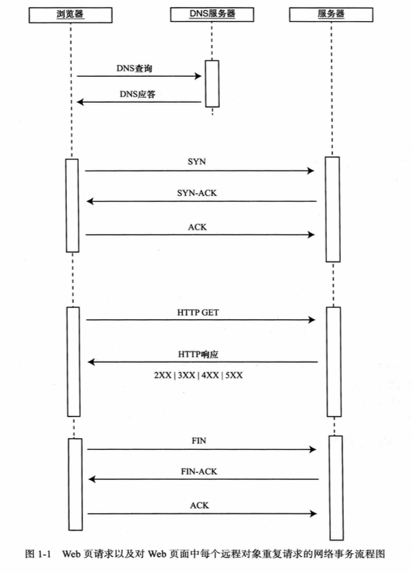

## 《JavaScript性能优化 度量、监控与可视化 》读书笔记
### 1、一个HTTP事务所需的步骤 P13

先看一张图



再来解释这张图：

当发送一个URL请求时，不管这个URL是Web页面上的URL还是Web页面上的每个资源的URL，浏览器都会开启一个线程来处理这个请求，同时在远程DNS服务器上启动一个DNS查询。这能使浏览器获得URL请求所对应的IP地址。

接下来，浏览器与远程Web服务器通过TCP三次握手协议来建立一个TCP/IP连接。该握手过程包裹一个同步（Synchronize）报文，一个同步-应答（Synchronize-Acknowledge）报文以及一个应答（Acknowledge）报文，这三个报文在浏览器和远程服务器间传递。该握手过程首先由客户端尝试建立通信，而后服务器应答并接受客户端的请求，最后由客户端发出该请求已经被接受的应答报文。

一旦TCP/IP连接建立，浏览器会通过该连接向远程服务器发送HTTP的GET请求。远程服务器找到资源并使用HTTP响应返回该资源，值为200的HTTP响应状态表示一个正确的响应。如果服务器没有找到资源或在解析资源时发生错误，或者如果请求被重定向了，HTTP响应会返回相应的状态值。

此时，Web服务器提供资源服务，客户端开始下载资源。与此同时，网页的全部负载，包括所有图片、CSS、JavaScript，粉墨登场了。

这里涉及到前端DNS优化，主要是减少DNS查询的次数。解决办法是在head里加入DNS Prefetch，推荐放在\<meta charset='UTF-8'\>的后面。

```html
<meta charset='UTF-8'>
<link rel='dns-prefetch' href='你的域名'>
```


具体请看[这遍文章](https://www.cnblogs.com/lhm166/articles/6073787.html)。

